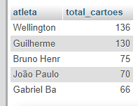

# Brasileirão - DB ETAD02
Trabalho realizado individualmente.\
Nome: Laura Antônia Siqueira
## Exercício 1:
* Listando todos os vencedores, excluindo os empates:

```sql

SELECT
vencedor AS time_vencedor,
COUNT(*) AS total_por_vencedor
FROM partida WHERE vencedor <> 'Empate'
GROUP BY vencedor
ORDER BY COUNT(*);

```


* Times que mais venceram partidas, excluindo os Empates:

```sql

SELECT vencedor AS time_vencedor, 
COUNT(*) AS total_por_vencedor 
FROM partida WHERE vencedor <> 'Empate' 
GROUP BY vencedor 
ORDER BY COUNT(*) DESC LIMIT 10;

```


* Times com menos vitórias, excluindo os Empates:

```sql

SELECT vencedor AS time_vencedor, 
COUNT(*) AS total_por_vencedor 
FROM partida WHERE vencedor <> 'Empate' 
GROUP BY vencedor 
ORDER BY count(*) LIMIT 10;

```


* Modificando o valor ‘-’ para empate

```sql

UPDATE partida 
 SET vencedor = 'Empate' 
 WHERE vencedor = '-';

```

Ao importar os dados CSV, analisei que quando os times empatavam nas partidas, o resultado voltava como um hífen (-). Modifiquei para empate para melhor entendimento dos dados.


## Exercício 2:

* Total por clubes que mais receberam cartões:

```sql

SELECT clube,
COUNT(*) AS total_por_clube 
FROM cartoes 
GROUP BY clube 
ORDER BY count(*) DESC LIMIT 10;

```


* Atletas com mais cartões, considerando a quantidade de dados por atleta e a diferença grande entre os últimos e o restante dos jogadores:

```sql

SELECT atleta, 
COUNT(*) AS total_cartoes
FROM cartoes
GROUP BY atleta
ORDER BY COUNT(*) DESC LIMIT 5;

```


## Exercício 3:

* GOLS, removendo valores nulos:

```sql

SELECT clube AS clubes, 
COUNT(*) AS total_por_clube 
FROM gols WHERE tipo_de_gol <> '' 
GROUP BY clubes 
ORDER BY COUNT(*);

```

* Artilheiros que fizeram mais gols nas partidas:

```sql

SELECT atleta, 
COUNT(*) AS total_por_atleta 
FROM gols 
GROUP BY atleta 
ORDER BY count(*) DESC LIMIT 5;

```
